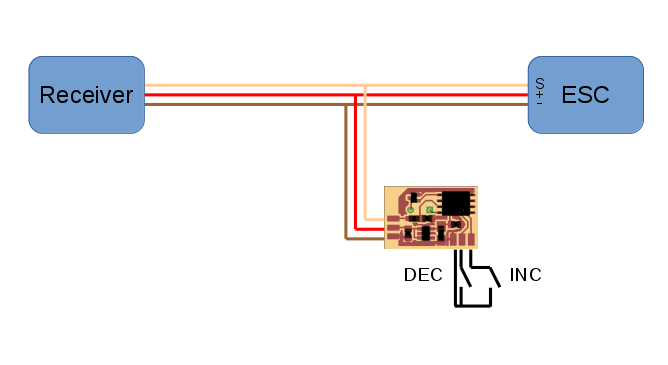

# Sonic Beacon

## Overview
This little device is supposed to provide an aid in finding small RC models in the grass or other obstacles. It does so by emitting series of loud beeps. It was originally designed to be used with Blade series of micro helicopters but can be used with any model that has throttle signal.

## Operating conditions
| Parameter | Value(s) |
| --- | --- |
| Input Voltage | 3...16 V |
| Input Signal Type | PWM >500 Hz or Standard Servo PWM 1500 uS center, <500Hz |
| Throttle Threshold PWM | 1/8 (12.5%) duty cycle |
| Throttle Threshold Servo | 1248 uS (25% of full throttle) |
## Modes of operation
Device has two modes of operation: auxiliary "calibration" which will be discussed later and main "normal".

## Theory of operation ("normal" mode)
1. Device gets powered on and automatically detects control signal type be it standard servo signal or PWM.
1. Device waits for the control signal to be higher than threshold value for more than 3 seconds then device becomes "armed".
1. Device waits for the control signal to be lower than threshold value for more than 30 seconds then device starts emitting series of tones and does so indefinitely.

## Practice of operation ("normal" mode)
1. Operator powers up model.
1. Operator starts flying model. To do so he pushes the throttle up, so throttle gets higher than the threshold. In 3 seconds beacon arms and emits two tones.
1. In the unfortunate event that the model can not be sighted after landing because of grass or other obstacles operator zeroes the throttle (or failsafe does so). After 30 seconds beacon starts emitting beeps and that aids operator in locating model ~~crash~~landing site.

## Connections


## Tone frequency calibration ("calibration" mode)
The frequency of the tone emitted by the device can be adjusted by user to accommodate for differences in hearing or variations in device base frequency. Adjusted frequency is stored in device's eeprom so it is not lost after power off.

Device pcb has two special pads for this purpose designated as **DEC** and **INC** in schematics and silk layer.
To adjust frequency it is needed to solder buttons from these pad to **GND** pad or use piece of wire or metallic tweezers or something similar. In the following we will refer to them as buttons for brevity.

To enter calibration mode **DEC** button must be pressed upon powering device on. Device starts emitting continuous tone. Frequency of the tone can be adjusted by pressing **INC** or **DEC** buttons. Adjusted frequency gets immediately stored in the eeprom. To exit this mode device needs to be powered off.

## Good practice
It is highly recommeded that after installation on the model device undergoes full functionality test. **_Any propellers and blades must be removed from the model before starting any tests._**

## Implementation details

### Directory structure
```
.
├── doc          - schematics in pdf, images
├── board        - schematics, board, library for Eagle
│   └── output   - Eagle output: pdf, tiff, etc.
└── firmware     - software sources for IAR Embedded Workbench
    ├── Release  - compiler output, ignored by git
    │   ├── Exe  - flash.hex (flash.bin) is a file you are looking For
    │   ├── List
    │   └── Obj
    └── settings - IAR settings, ignored by git
```

### Schematics in pdf
[Here.](doc/sonic_beacon.pdf)

### Components
* MCU - ATtiny85-20, as firmware size is under 4k so ATtiny45-20 should also do. Uses 8 MHz internal RC clock which provides for stable operation at as low as 2.7V.
* Voltage Regulator - TI LP2981-33 ultra-low dropout. Provides 3-16V working voltage range.

### Fuses

```
SELFPRGEN = [ ]
RSTDISBL = [ ]
DWEN = [ ]
SPIEN = [X]
WDTON = [ ]
EESAVE = [X]
BODLEVEL = 1V8
CKDIV8 = [ ]
CKOUT = [ ]
SUT_CKSEL = INTRCOSC_8MHZ_6CK_14CK_64MS

EXTENDED = 0xFF
HIGH = 0xD6
LOW = 0xE2
```

### Places of interest in source files
1. [Where the throttle threshold is defined for PWM signal?](https://github.com/vovets/sonic_beacon/blob/433788d3e038b642e70308b3990e0a55145812b6/firmware/sonic_beacon.c#L87)
1. [Where the throttle threshold is defined for Servo signal?](https://github.com/vovets/sonic_beacon/blob/433788d3e038b642e70308b3990e0a55145812b6/firmware/signal_detection.c#L192)

### Software versions
Software versions with which board and firmware were developed.
1. Eagle 7.5 or 7.7
1. IAR Embedded Workbench 6.8

### Cheap hardware/sofware for firmware flashing
* [usbasp](http://www.fischl.de/usbasp/) - under $5 usb device for flashing AVR MCUs. Can be found on ebay, aliexpress, banggood and even hobbyking. 
* [avrdude](https://www.nongnu.org/avrdude/) - command line software for flashing AVR MCUs. There are versions for Windows and GUI tools available.
